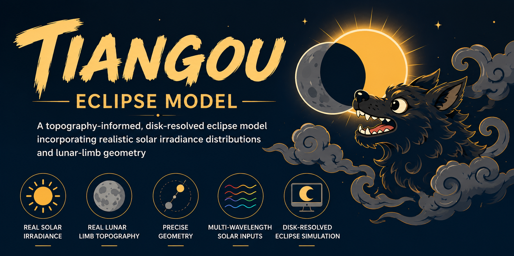

# TIANGOU Eclipse Model



**T**opography-aware **I**rradiance **A**nd **N**onuniform-**G**eometry
**O**ccultation **U**tility

TIANGOU is a general-purpose, topography-aware solar-eclipse radiative
occultation model designed for atmospheric, ionospheric, and coupled geospace
simulations. It combines spatially nonuniform solar imagery,
observer-dependent Sun-Moon geometry, lunar topography, and
wavelength-dependent solar irradiance to calculate the time-, altitude-,
location-, and spectrum-dependent transmission of solar radiation during an
eclipse. By resolving the irregular lunar limb and heterogeneous solar
emission instead of assuming uniform circular disks, TIANGOU provides
physically realistic eclipse forcing for radiative transfer, photochemistry,
atmospheric dynamics, and atmosphere-ionosphere coupling studies. The current
reference workflow supports WACCM and WACCM-X, while the model framework is
intended for broader use in atmospheric models and solar-eclipse radiation
applications.

The TIANGOU workflow combines:

- SDO/AIA and GOES-16/SUVI solar images;
- a lunar true limb built from SLDEM2015 and polar LOLA LDEM products;
- NAIF SPICE geometry;
- nine source-channel masks; and
- official FISM2 high-resolution and 23 Stan-band irradiance products.

The final product is
`mask_euv(time, band, z, lat, lon)`, a dimensionless transmission factor in
`[0, 1]`. It is not an irradiance field. Eclipsed irradiance is obtained later
as `FISM2_flux(time, band) * mask_euv(...)`.

## Configuration

| Item | Value |
| --- | --- |
| Source masks | AIA 94, 131, 171, 193, 211, 304, 335, 1600 A; SUVI 284 A |
| Source count | 9 |
| Output bands | 23 FISM2 Stan bands |
| Vertical grid | WACCM6, 70 levels |
| Horizontal grid | 192 x 288, 0.9375 x 1.25 degrees |
| Cadence | 5 minutes |
| Long-wavelength source | AIA 1600 A |
| Repeated Stan bands | N2 cross-section classes |
| Solar-image resolution | Every pixel in each downloaded FITS image |
| Lunar-terrain resolution | Every applicable DEM pixel at archive-native spacing |

The `192 x 288` grid is the requested WACCM output grid. It does not alter the
resolution of the solar images or lunar terrain used inside each grid-point
occultation calculation.

## Software prerequisites

- Linux, macOS, or Windows Subsystem for Linux with Bash;
- Python 3.11 or newer with `venv` and `pip`;
- NumPy, Xarray, netCDF4, Requests, SpiceyPy, Astropy, Beautiful Soup, DRMS,
  and python-dateutil, as specified in `requirements.txt`.

## Run from zero

The one-command path creates a virtual environment, downloads every external
input, checks the staged data, calculates the nine source-mask cubes, and then
builds and validates the 23-band product:

```bash
./run_from_zero.sh 2024-04-08 15:00:00 21:00:00
```

The lunar DEM download is about 3.3 GB. Existing DEM files may be reused:

```bash
SKIP_DEM_DOWNLOAD=1 \
TIANGOU_DATA_ROOT=/path/to/staged/data \
./run_from_zero.sh 2024-04-08
```

To download and validate the inputs without starting the mask calculation:

```bash
PREPARE_ONLY=1 ./run_from_zero.sh 2024-04-08
```

The calculation is restartable. Existing snapshot files are retained, and
running the same command again continues with the first missing snapshot.
The default is one local worker process. A personal computer with additional
cores can use, for example:

```bash
TIANGOU_WORKERS=4 ./run_from_zero.sh 2024-04-08
```

## Staged data layout

```text
data/
  kernels/
  lunar_dem/
    sldem2015_128_60s_60n_000_360_float.{img,lbl}
    polar/ldem_60{n,s}_240m_float.{img,lbl}
  solar/
    aia_YYYYMMDD_5min/files/<band>/
    suvi_YYYYMMDD_5min/files/ci284/
  fism2/by_date/YYYY-MM-DD/
  output/
    source_masks/
    final_masks/
```

## Output

For an event `YYYY-MM-DD`, the final file is written under:

```text
data/output/final_masks/YYYYMMDD_tiangou_23band/
  TIANGOU_Mask_YYYY_MM_DD_waccm6_70_23band.nc
```

A sibling `*.validation.json` records the dimension, metadata, source-order,
range, and NaN checks.

## Repository map

- `tiangou/`: solar-image loading, SPICE geometry, lunar DEM reading, limb construction, and image occultation.
- `scripts/`: downloads, local execution, snapshot computation, and validation.
- `pipeline/`: source-cube assembly and FISM2-weighted 23-band synthesis.
- `docs/METHOD.md`: start-to-finish algorithm and equations.
- `docs/DATA_SOURCES.md`: input provenance and citation guidance.

## Reuse existing staged data

The input checker supports separate roots, which is useful when large data are
already managed outside this repository:

```bash
.venv/bin/python scripts/preflight.py \
  --event 2024-04-08 \
  --solar-root /path/to/solar \
  --fism-root /path/to/fism2/by_date \
  --dem-root /path/to/lunar_dem \
  --kernel-root /path/to/kernels
```

The corresponding local calculation command is:

```bash
.venv/bin/python scripts/run_event.py \
  --event 2024-04-08 \
  --data-root /path/to/tiangou-data \
  --solar-root /path/to/solar \
  --fism-root /path/to/fism2/by_date \
  --dem-root /path/to/lunar_dem \
  --kernel-root /path/to/kernels
```

*The name **TIANGOU** draws on traditional Chinese eclipse imagery, connecting
early interpretations of eclipses with modern, physically resolved simulation.*

## Availability and license

The TIANGOU source code is publicly available under the
[PolyForm Noncommercial License 1.0.0](LICENSE). Noncommercial use, copying,
modification, and redistribution of the original or modified software are
permitted. Commercial use is prohibited unless the copyright holder grants a
separate written license. Every redistributed copy must include the license
terms.

External FITS, FISM2, SPICE, and lunar DEM products are not redistributed by
this repository and remain subject to the terms of their respective providers.
